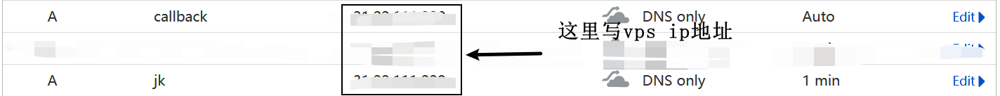
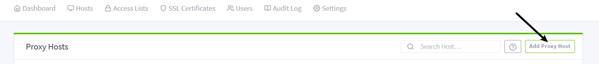
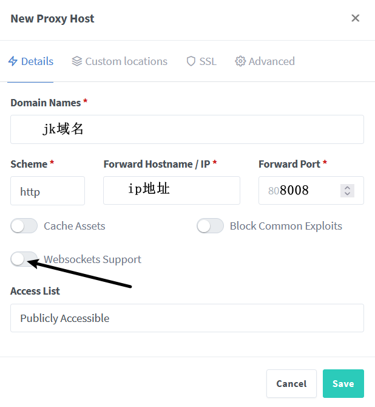
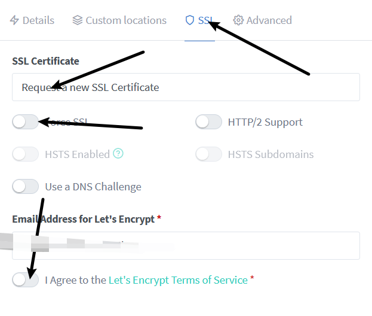
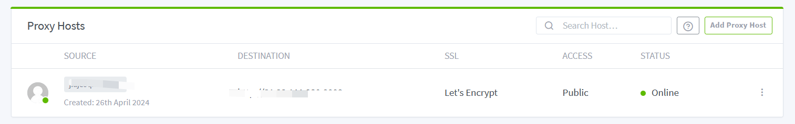
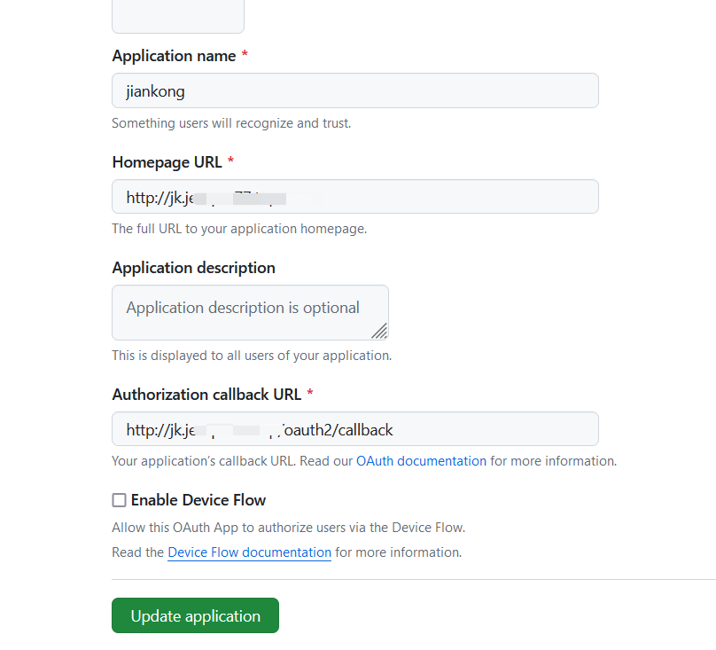
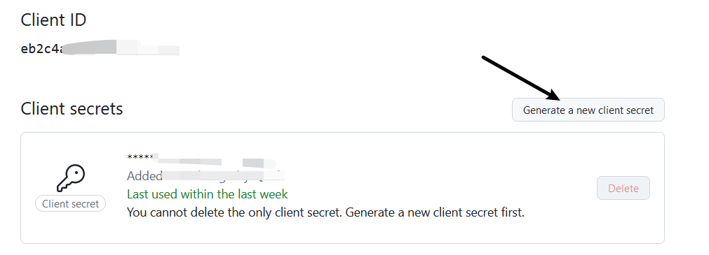
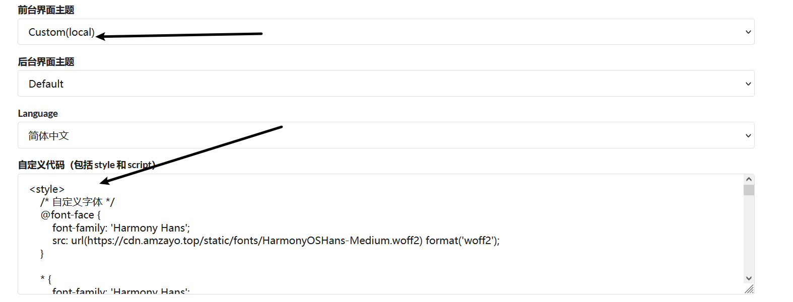

+++
title = '一键部署哪吒监控！统一管理你的VPS服务器'
date = 2024-06-28T21:42:57+08:00
tags = ["哪吒"]
showSummary = true
summary = "随时随地看服务器状态"
featured_image = "/images/esmeralda.jpg"

+++

##  准备一台VPS

这一步并不过多说明，这是最基础的，如果不懂怎么购买vps，请google，购买合适自己的VPS。

## **用ssh工具登录并更新系统环境**

### 更新vps系统环境

apt update -y && apt install -y curl socat wget sudo

### 安装Docker

```
curl -fsSL https://get.docker.com | sh
```

### 一键安装 Nginx Proxy Manager：

```
docker run -d \
  --name=npm \
  -p 80:80 \
  -p 81:81 \
  -p 443:443 \
  -v /home/npm/data:/data \
  -v /home/npm/letsencrypt:/etc/letsencrypt \
  --restart=always \
  jc21/nginx-proxy-manager:latest
```

### 安装成功后进入NGINX后台面板：

服务器IP加81端口访问网页

用户：admin@example.com

密码：changeme

登入后记得先修改密码！

## **准备二个子域名**

域名托管到cf上，添加两个子域名解析，如下图：


ps：jk域名作为前端，callback则是后端。

## **Nginx 管理器反代**




!

到这里，nginx反代也成功了，如下图：


## **GitHub上 创建一个 OAuth Apps**

- 获取链接：[https://github.com/settings/developers](https://github.com/settings/developers)


- 添加一个New OAuth App

Application name：名称自定义

Homepage URL：前端地址

Authorization callback URL：前端地址+/oauth2/callback

如下图：


注册申请后，把客户ID和生成新的密钥复制下来保存，如下图：


## **一键安装哪吒监控面板**

### 下载脚本

```
wget -O nezha.sh https://raw.githubusercontent.com/lvgj-stack/nezha/master/script/install.sh && sudo bash nezha.sh
```

官方脚本：

```
curl -L https://raw.githubusercontent.com/naiba/nezha/master/script/install.sh -o nezha.sh && chmod +x nezha.sh && sudo ./nezha.sh
```

按照提示添写相关信息后登录面板。

### 脚本中选14继续安装amzayo佬的自定义主题

安装完成后，回到浏览器后台管理页面，写入css文件。

css地址：[http://vps15o.181000.xyz:9999/amzayo_css.txt](http://vps15o.181000.xyz:9999/amzayo_css.txt)

如下图：


将前端切换到custom，查看效果