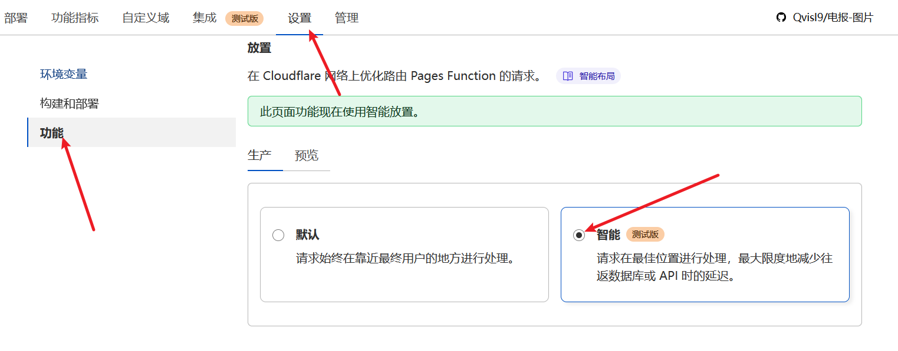

+++
title = 'Telegraph Image：搭建你的专属开源图床'
date = 2024-06-29T13:35:34+08:00
tags = ["图床"]
showSummary = true
summary = "搭建一个专属于你自己的开源图床"
featured_image = "/images/ltys.png"

+++

## 开始部署

#### Pages 部署 **telegraph-Image 项目**

- 打开<u>[telegraph-Image仓库](https://github.com/x-dr/telegraph-Image)</u>项目，先给作者点击`Star`后再点击`Fork`


- 回到 **Workers 和 Pages** > **概述** > **创建** > **Pages** > **连接到Git** > 选择`telegraph-Image`项目 > **保存并部署**即可


#### 绑定自定义域

- 这里推荐优先使用已经转入CF的域名，并开启**小黄云**。如果你没有域名，也可以退而求其次使用**CNAME方式**使用免费域名接入自定义域。


- 回到 **Workers 和 Pages /**`telegraph-Image`项目 > **设置** > **函数** > **放置** > **制作** > **智能** > **保存**




#### 创建管理后台

- 回到 **Workers 和 Pages** > **D1** > **创建数据库** > **仪表盘** > 数据库名称`img`*(名称可取任意值)* > **创建**


- 进入`img`数据库 > **控制台** > `粘贴以下代码`后 > 点击**执行** > 等待提示**此查询已成功执行。**  


```
DROP TABLE IF EXISTS tgimglog;
CREATE TABLE IF NOT EXISTS tgimglog (
    `id` integer PRIMARY KEY NOT NULL,
    `url` text,
    `referer` text,
    `ip` varchar(255),
    `time` DATE
);
DROP TABLE IF EXISTS imginfo;
CREATE TABLE IF NOT EXISTS imginfo (
    `id` integer PRIMARY KEY NOT NULL,
    `url` text,
    `referer` text,
    `ip` varchar(255),
    `rating` text,
    `total` integer,
    `time` DATE
);
```

- 回到 **Workers 和 Pages /**`telegraph-Image`项目 > **设置** > **函数** > **D1 数据库绑定** > 变量名`IMG` > `img`数据库 > 点击**保存**


- 回到 **Workers 和 Pages /**`telegraph-Image`项目 > **设置** > **环境变量** > **为生产环境定义变量** > 变量内容如下:


变量名`BASIC_USER`，值为你的**后台管理员用户名**

变量名`BASIC_PASS`，值为你的**后台管理员密码**

- 点击**保存**


- 回到 **Workers 和 Pages /**`telegraph-Image`项目 > **部署** > 右下角**三个点** > **重试部署**即可