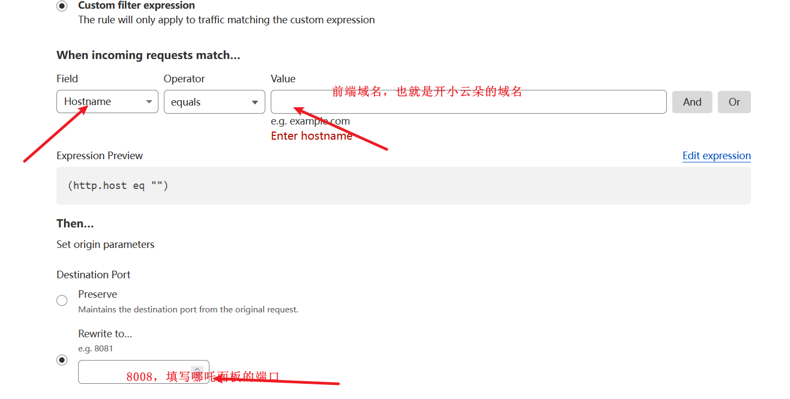

+++
title = '通过cloudflare直接访问哪吒探针'
date = 2024-06-29T14:02:09+08:00
tags = ["哪吒"]
showSummary = true
summary = "另一种搭建哪吒探针的方案"
featured_image = "/images/29-feature.jpg"

+++

## 准备一台vps

这一步并不过多说明，这是最基础的，如果不懂怎么购买vps，请google，购买合适自己的VPS。

## 用ssh工具登录并更新系统环境

### 更新vps系统环境：

```
apt update -y && apt install -y curl socat wget sudo
```

### 安装Docker：

```
curl -fsSL https://get.docker.com | sh
```

## 准备二个子域名并进行相关配置

域名托管到cf上，添加两个子域名解析，前端域名开启小云朵。如下图：


左侧Rules-Origin Rules，然后填写如下图信息：



完成后直接部署。

左侧SSL设置为“灵活”。


## GitHub上 创建一个 OAuth Apps

1.获取链接：[https://github.com/settings/developers](https://github.com/settings/developers)

2.添加一个New OAuth App

Application name：名称自定义

Homepage URL：前端地址

Authorization callback URL：前端地址+/oauth2/callback

如下图：


ps：**一定要https！！！**

## 一键安装哪吒监控面板

```
curl -L https://raw.githubusercontent.com/naiba/nezha/master/script/install.sh -o nezha.sh && chmod +x nezha.sh && sudo ./nezha.sh
```

至此就能直接用域名访问哪吒面板，省去反代这个步骤！


